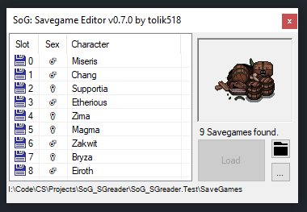

# SoG Savegame Editor 
 

## Download
Head over to the releases if you are just here for the [download link](https://github.com/tolik518/SoG_SGreader/releases), then press on `Assets`   
on the latest version and download the `SoG_SGreader.zip` file. 

Or just [press here](https://github.com/tolik518/SoG_SGreader/releases/latest/download/SoG_SGreader.zip) to download the latest version.

## How to use


You can just run the exe and it will open a file dialog where you can select your savegame file.
After that you can edit your savegame and save it back to the same file.

Alternatively you can drag and drop your savegame file on the exe and it will open the savegame directly.

You can also use the command line to open a savegame file directly.
```
SoG_SGreader.exe <savegame path> # Open UI with savegame, path to savegame is optional

SoG_SGreader.exe --help # Show help
SoG_SGreader.exe --patch # Show the supported game version
SoG_SGreader.exe --version # Show the version of the program

SoG_SGreader.exe --json <savegame path> # Print json of the savegame to console
SoG_SGreader.exe --text <savegame path> # Show a short summary of the savegame
```

You could for example use [jq](https://jqlang.github.io/jq/) to get a specific value from the savegame, like the level of the character.
```
/home/developer/Projects/CSharp/SoG_SGreader/SoG_SGreader/bin/Debug/SoG_SGreader.exe --json "/home/developer/.config/Secrets of Grindea/Characters/2.cha" | jq .Level
```

## Description

**SoG Savegame Editor** is a tool for editing [Secrets of Grindea](https://store.steampowered.com/app/269770/Secrets_of_Grindea/) savegames.
You can edit your nickname, skill points, gold, equipment, inventory, your pets and much more is coming!

If you are interested how the save game file is build, you can find the structure   
of the save game on the [wiki page](https://github.com/tolik518/SoG_SGreader/wiki/Savegame-File-Structure) (not actively maintained).    
  

  
  
If you want your savegame to work you need to save it over to "%APPDATA%\Secrets of Grindea\Characters" and name it 0.cha to 8.cha
  


Keywords: "Secrets of Grindea Savegame", "Secrets of Grindea Savegame Editor", "save file", "Character File"
